# End to End Automatic Speech Recognition
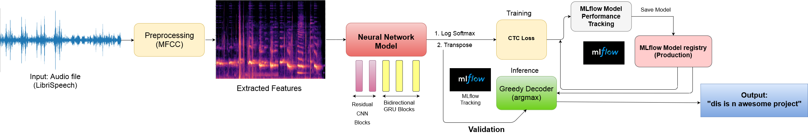<br>

In this repository, I have developed an end to end Automatic speech recognition project. I have developed the neural network model for automatic speech recognition with PyTorch and used MLflow to manage the ML lifecycle, including experimentation, reproducibility, deployment, and a central model registry. The Neural Acoustic model is built with reference to the DeepSpeech2 model, but not the exact DeepSpeach2 model or the DeepSpeech model as mentioned in their respective research papers.

## Technologies used:
1. MLflow.<br>
    - to manage the ML lifecycle.
    - to track and compare model performance in the ml lifecyle.
    - experimentation, reproducibility, deployment, and a central model registry.
2. Pytorch.<br>
    - The Acoustic Neural Network is implemented with pytorch.
    - torchaudio for feature extraction and data pre-processing.

## Speech Recognition Pipeline

<br>

### Dataset
In this project, the LibriSpeech dataset has been used to train and validate the model. It has audio data for input and text speech for the respective audio to be predicted by our model. Also, I have used a subset of 2000 files from the training and test set of the LibriSpeech dataset for faster training and validation over limited GPU power and usage limit.

### Pre-Processing
In this process Torchaudio has been used to extract the waveform and sampling rate from the audiofile. Then have been used <b>MFCC(Mel-frequency cepstrum coefficients)</b> for feature extraction from the waveform. <b>MelSpectogram</b>, <b>Spectogram</b> and <b>Frequency Masking</b> could also be used in this case for feature exxtraction.

### Acoustic Model architecture.
The Neural Network architecture consist of <b>Residul-CNN blocks</b>, <b>BidirectionalGRU blocks</b>, and <b>fully connected Linear layers</b> for final classification. From the input layer, we have two Residual CNN blocks with batch normalization, followed by a fully connected layer, hence connecting it to three bi-directional GRU blocks and finally fully connected linear layers for classification.<br>

CTC(Connectionist Temporal Classification) Loss as the base loss function for our model and AdamW as the optimizer.

### Decoding
We have used <b>Greedy Decoder</b> which argmax's the output of the Neural Network and transforms it into text through character mapping.

## ML Lifecycle Pipeline

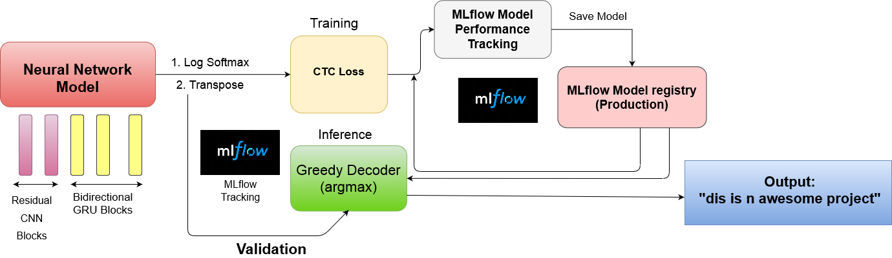<br>
We start by initializing the mlflow server where we need to specify backend storage, artifact uri, host and the port. Then we create an experiment, start a run within the experiment which inturn tracks the training and validation loss. Then we save the model followed by registring it and further use the registered model for deployment over the production.

## Implementation

First we need to initialize the mlflow server.
```sh
mlflow run -e server . 
```
To start the server in a non-conda environmnet
```sh
mlflow run -e server . --no-conda
```
the server could also be initialized directly from the terminal by the following command. But for this the tracking uri need to be set manually.
```sh
mlflow server \
--backend-store-uri sqlite:///mlflow.db \
--default-artifact-root ./mlruns \
--host 127.0.0.1
```
Then we need to start the model training. 
```sh
mlflow run -e train --experiment-name "SpeechRecognition" . -P epoch=20 -P batch=32
```
To train in non-conda environment.
```sh
mlflow run -e train --experiment-name "SpeechRecognition" . -P epoch=20 -P batch=32 --no-conda
```
To train the model through python command.
```sh
python main.py --epoch=20 --batch=20
```
This command functions the same as the above mlflow commands. It's just that I was facing some issues or bugs while running with mlflow command which worked prefectly fine while running with the python command.
<br>
## Trained model performance
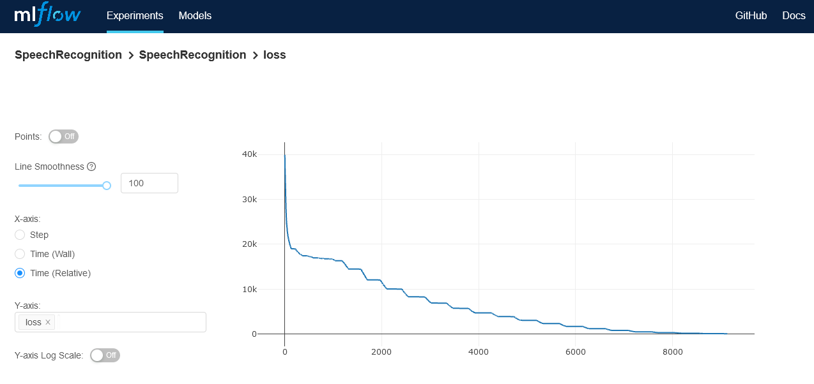<br>
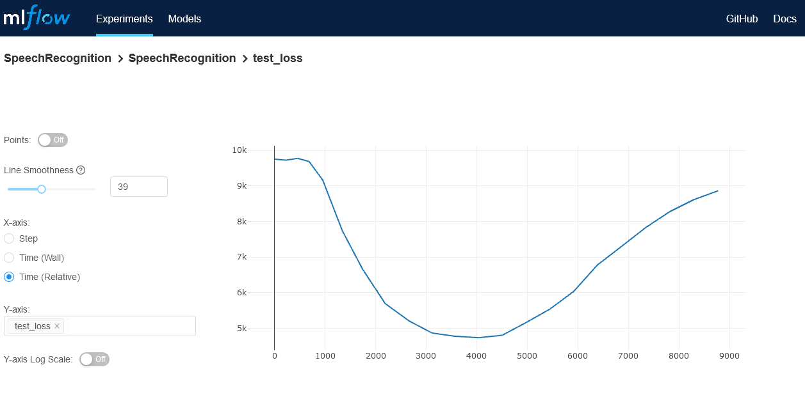<br>
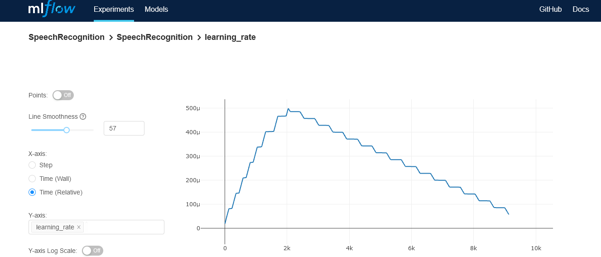<br>
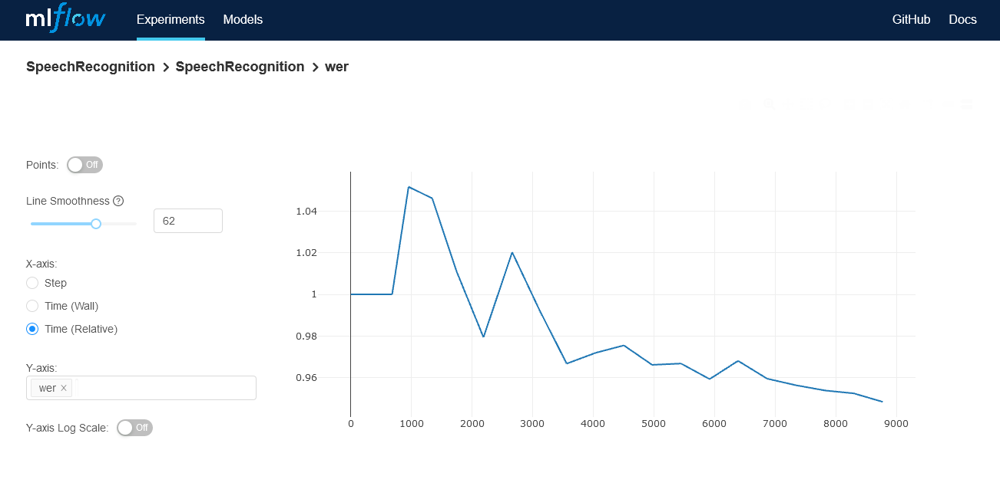<br>
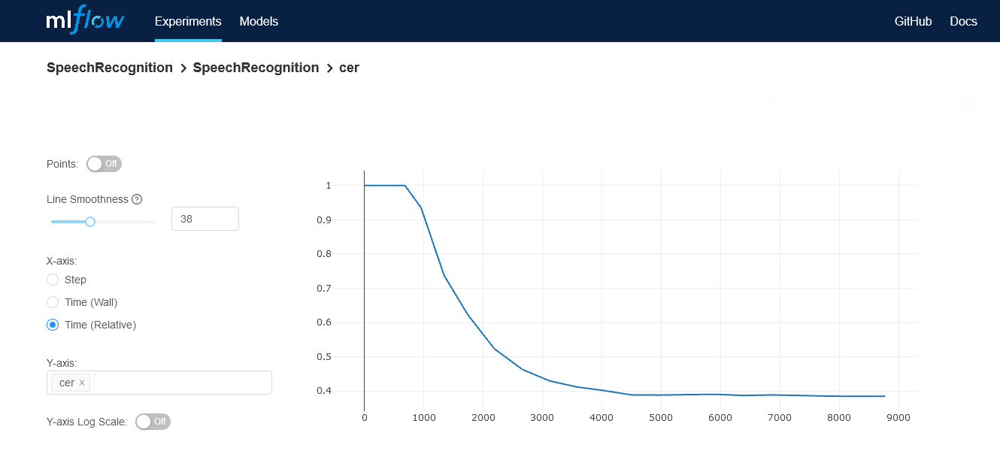<br>
Now its time to validate the registered model. Enter the registered model name with respective model stage and version and file_id of the LibriSpeech dataset Test file.
```sh
mlflow run -e validate . -P train=False -P registered_model=SpeechRecognitionModel -P model_stage=Production file_id=1089-134686-0000
```
```sh
python main.py --train=False --registered_model=SpeechRecognitionModel --model_stage=Production --file_id=1089-134686-0000
```
### Dashboard
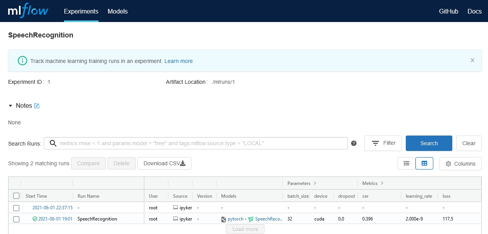<br>
### Rregistered model
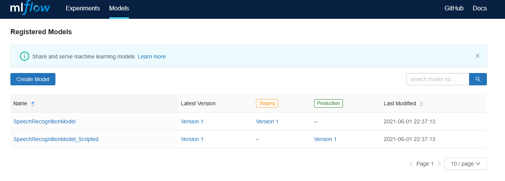<br>
### Artifacts
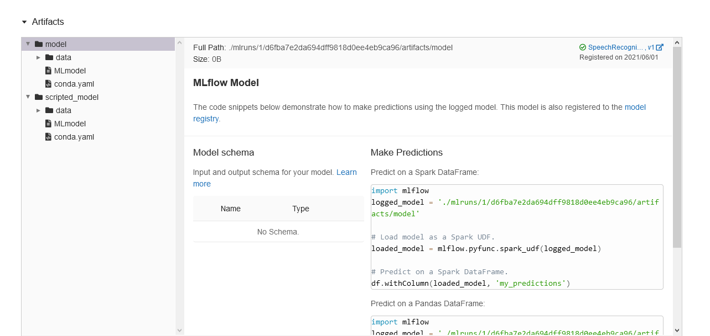<br>
## Results

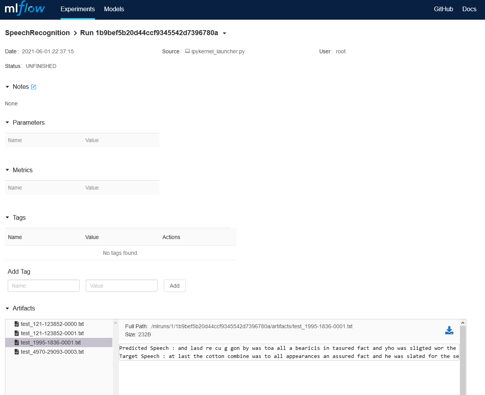<br>
```
Target: she spoke with a sudden energy which partook of fear and passion and flushed her thin cheek and made her languid eyes flash
Predicted: she spot with a sudn inderge which pert huopk obeer an pasion amd hust her sting cheek and mad herlang wld ise flush
```
```
Target: we look for that reward which eye hath not seen nor ear heard neither hath entered into the heart of man
Predicted: we look forthat rewrd which i havt notse mor iear herd meter hat entere incs the hard oftmon
```
```
Target: there was a grim smile of amusement on his shrewd face
Predicted: there was a grim smiriel of a mise men puisoreud face
```
```
Target: if this matter is not to become public we must give ourselves certain powers and resolve ourselves into a small private court martial
Predicted: if this motere is not to mecome pubotk we mestgoeourselv certan pouors and resal orselveent a srmall pribut court nmatheld
```
```
Taarget: no good my dear watson
Predicted: no good my deare otsen 
```
```
Target: well she was better though she had had a bad night
Predicted: all she ws bhatter thu shu oid hahabaut night 
```
```
Target: the air is heavy the sea is calm
Predicted: the ar is haavyd the see is coomd 
```
```
Target: i left you on a continent and here i have the honor of finding you on an island
Predicted: i left you n a contonent and herei hafe the aner a find de youw on an ihalnd 
```
```
Target: the young man is in bondage and much i fear his death is decreed
Predicted: th young manis an bondage end much iffeer his dethis de creed 
```
```
Target: hay fever a heart trouble caused by falling in love with a grass widow
Predicted: hay fever ahar trbrl cawaese buy fallling itlelov wit the gressh wideo
```
```
Target: bravely and generously has he battled in my behalf and this and more will i dare in his service
Predicted: bravly ansjenereusly has he btaoled and miy ba hah andthis en morera welig darind his serves 
```
## Future Scopes
- There are other Neural Network models like Wav2Vec, Jasper which also be used and tested against for better model performance.
- This is not a realtime automatic speech recognition project, where human speech would be decoded to text in realtime like in Amazon Alexa and Google Assistant. It takes reads audo file as input and returns predicted speech.
So, this could be taken to further limits by developing it into a real-time automatic speech recognition.
- The entire project has been done for local deployment. For productionizing the model and datasets AWS s3 bucket and Microsoft Azure could be used, also Kubernetes would also serve as a better option for pructionizing the model.
